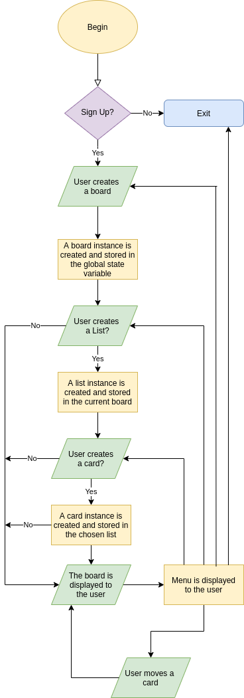

# Kan-CLI

## Github Repository

https://github.com/r0ss26/Kan-CLI

## Introduction

Kanban boards are widely used within project management for tracking the progress of tasks. Such boards allow individuals or teams to organise tasks into specific groups to visualise, track and share progress. My Ruby terminal application, Kan-CLI implements this functionality within a command line environment for distraction free issue tracking.

### Components of a Kanban Board

Kanban boards are made up of a variety of elements which come together to form a workflow. A Kanban workflow comprises a hierarchical relationship between "Boards", "Lists" and "Cards".  Typically a board will be used to represent a project. Lists can be used to organise tasks into categories, while cards represent individual tasks. Within an Agile methodology, cards often represent user stories. However, Kanban boards are extremely flexible and can be used for managing any type of project or task. (https://www.atlassian.com/agile/kanban/boards)

## Purpose & Scope

### What does Kan-CLI do?

As a broad overview Kan-CLI is a tool for organising projects by category, status and task.

Kan-CLI allows users to create boards, lists and cards which form a hierarchical relationship as described under [Components of a Kanban Board](#Components-of-a-Kanban-board). Users are able to place cards within different lists. Users may set a limit to the number of cards that can be added to a list. This allows the user to stay focused on a defined number of tasks and help manage task overload, facilitating a streamlined workflow.

### Why make a CLI Kanban board?

The two main problems with most popular Kanban boards is a lack of offline support and potential for distraction when run in a web browser. As a command line application, Kan-CLI can help users manage their projects without the need for an internet connection. This can also reduce potential distractions allowing users to direct their focus to the task at hand.

Kan-CLI aims to provide users with distraction free workflow management. Kan-CLI provides the ideal environment for getting offline tasks done, without the distraction of a browser based GUI. 

### Who is the target audience?

Since Kan-CLI does not require an internet connection, it is ideal for writers, people who don't have access to a reliable internet connection or those who work while travelling/commuting. It can also be used by people who want to remove the temptation to be distracted by time wasting sites and manage projects without distraction.

### How will users interact with Kan-CLI?

Users will interact with the workflow hierarchy through a combination of multiple choice and text input interaction. The app will guide them through the creation of boards, lists and cards.

When a user runs the Kan-CLI command they will be prompted to create a board. Once the user has created a board they can then input a number of lists to categorise their tasks. The user can then create individual cards which they can associate with a list. This association can be changed as the user progresses through their work flow, allowing for interactive and dynamic task management.

## Features

### Create Boards

Users will be able to create boards with a title of their choosing. Boards will be a container for lists and cards relating to different projects. The board will be made up of a title, a creation date and associated lists.

### Create & Delete Lists

Users will be able to add lists to their boards. Lists are containers for storing cards and can be named according to the users needs (for example by category or by task status). The user will be able to set a limit for the maximum number of cards to store in a list to assist in managing workloads effectively and not overload particular categories. 

### Create & Delete Cards

Cards will be used to track individual issues/tasks (or any other user defined characteristic). Cards are one level below lists. The user will be able to create cards and associate them with any list on their board.

### Dynamically Categorise Cards Within Lists

Users will be able to move cards between lists, this will allow for users to move cards around to represent their workflow and current status.

### Track How Long a Card has Been Active For

When a user creates a card it will be activated. Users will be able to see how long any card has been active for so that they can track how long they have been working on an activity. The card will be deactivated when it is moved to the "Completed Tasks" list.

## User Interaction

The user will interact with the application via two main inputs

- Menu selection using arrow keys
- Text input

### Menu Selection

All menu prompts will be prepended with a call to action explicitly asking the user which functionality they would like to invoke. Help text will inform the user they need to use the arrow keys to select an option, and press the Enter key to select.

A green arrow will point to the currently selected option, and the option will be highlighted green to give the user a visual cue for their selection. Once selected the users choice will be displayed on the previous line in green, so that the user can see their previous choice.

### Text Interaction

All text interactions will be prompted with a call to action followed by a colon and a blank cursor indicating the user to type a response.

### Error Handling

Whenever the user attempts to perform an action that is not allowed by the application. An error message describing why the action cannot be performed is printed to the console in red text. They will then be re-prompted to perform the action.

During the setup phase of the application the user will be guided through a series of menu selection and text prompts in order to get the application setup. After the initial setup the user will be shown a visual representation of their board, along with a menu asking them what they would like to do next. This menu will run the interaction loop again at a specific point to allow the user to modify their board.

## Control Flow

## Implementation Plan

Priorities (All checklist items are the same priority level as the relevant feature unless explicitly specified):

- Highest
- Moderate
- Lowest

### Boards

There will be board class - a board object will be created when the user runs the program and is prompted to create a board. The board class will have methods for adding lists and removing lists to and from itself, it will also have a title and a creation date.

- [x] Define a Board class and implement attributes for

  - [x] title
  - [x] creation date
  - [x] lists in the board

- [x] Define a method for adding lists

- [x] Define a method for removing lists

- [x] Define a method for displaying itself to the user

  Deadline: Complete by end of day 10/03/20

### Lists

There will be a List class - list objects will be created when the user is prompted to make lists. There will also be an option to add more lists to the board later on.

- [x] Define a List class and implement attributes for 

  - [x] title
  - [x] card limit
  - [x] cards

- [x] Define a method for adding a card to a list

- [x] Define a method deleting a card from a list

  Deadline: Complete by end of day 10/03/20

### Cards

There will be a Card class - card objects will have an ID, description and a creation date.

- [x] Define a Card class and implement attributes for

  - [x] id

  - [x] description

  - [x] creation date

    Deadline: Complete by end of day 10/03/2

### Control Flow

Define methods for the following

- [x] Prompting the user to sign up

- [x] Prompting the user to create a board 

- [x] Prompting the user to create lists

- [x] Prompting the user to create cards

- [x] Prompting the user to move cards

- [x] Display a menu to handle the above user interactions

  Deadline: Complete by end of day 11/03/20

### Login/Logout

- [x] Allow the user to sign up
- [ ] Store the users credentials
- [ ] On quit, save the state of the users session

## Help Documentation

Documentation is also available by running `app.rb -help`

### Installation Instructions

#### System Requirements

Kan-CLI as a command line application developed for Unix based systems.

#### Dependencies

For the best experience make sure you have figlet installed on your computer.

The application should still run without it, however it will display a warning and will be unable to display the welcome message.

To install figlet run:

`$ sudo apt-get install figlet` 

or using homebrew:

`$ brew install figlet`

The program may not run if you don't install lolcat:

`$ sudo apt-get install lolcat`

`$ brew install lolcat`

The following gems are required for the program to work:

`$ gem install lolcat`

`$ gem install tty-prompt`

`$ gem install tty-box`

`$ gem install suid`

`$ gem install colorize`

`$ gem install colorized-string`

To run Kan-CLI clone the repository and execute:

`$ ruby app.rb` from within the `/src` directory

 

